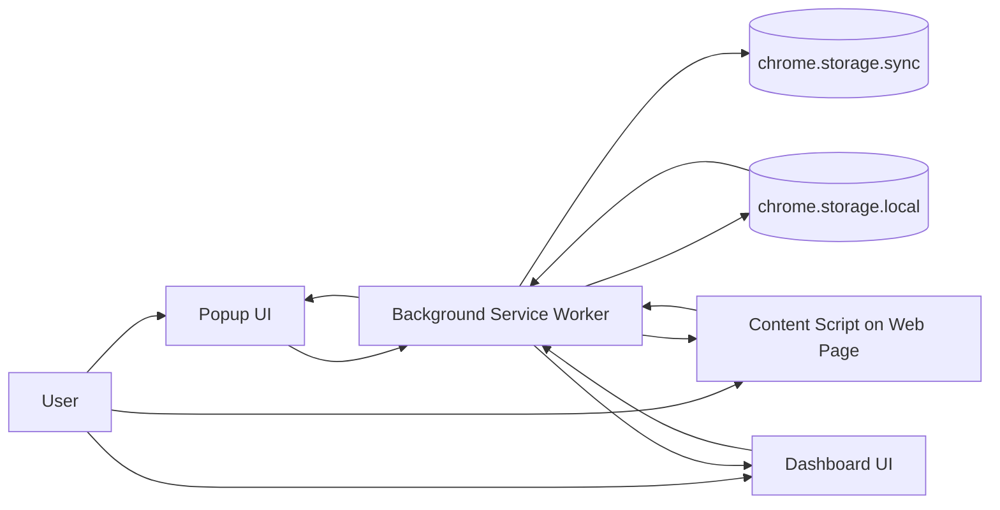
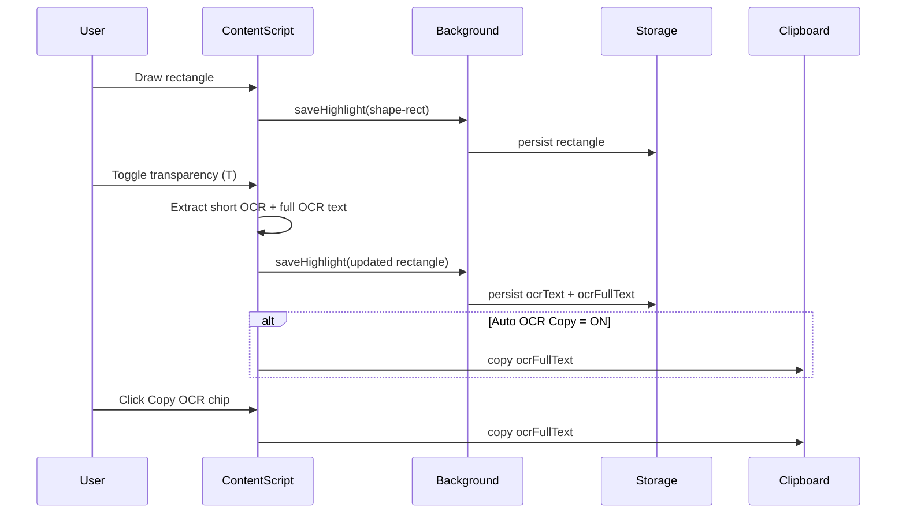

# HighlightMaster

## Part A: Quick Start (For Novice Programmers)

### 1) Very Short Description
HighlightMaster is a browser extension that lets you highlight text, draw rectangles, capture OCR-style text from rectangles, and manage everything from a popup and a live web dashboard.

### 2) Install on Any Chromium Browser
Supported: Chrome, Brave, Edge, Opera, Vivaldi.

1. Open your extensions page:
- Chrome: `chrome://extensions`
- Brave: `brave://extensions`
- Edge: `edge://extensions`
- Opera: `opera://extensions`
2. Enable `Developer mode`.
3. Click `Load unpacked`.
4. Select folder: `d:\extentions\highlight-master`.
5. Pin the extension.

### 3) What You Can Do
- Highlight selected text with color.
- Draw rectangle highlights.
- Make a rectangle transparent and copy OCR text from the `Copy OCR` chip.
- Auto-copy OCR text when rectangle transparency is enabled (if OCR toggle is ON).
- Add notes and pin important highlights.
- Search, filter, and sort highlights.
- Organize data with categories.
- Attach images/PDF/files to highlights.
- Preview image and PDF attachments.
- Use popup + dashboard with real-time updates.
- Export, import, restore, and undo data.

### 4) Quick Button Guide

#### Popup (top and footer)
- `Dashboard`: Open dashboard in a separate tab.
- `Rectangle icon`: Start one-time rectangle draw mode.
- `OCR`: Toggle automatic OCR copy when a rectangle becomes transparent.
- `Enable/Disable switch`: Turn the extension on/off.
- `HL`: Toggle continuous text highlight mode.
- `All / Pinned / Timeline`: Change current view.
- `Export / Import / Restore / Deleted CSV`: Data operations.

#### On page
- Click highlighted text or rectangle to reopen floating color toolbar.
- On transparent rectangle, click `Copy OCR` chip to copy OCR text.
- Right-click highlighted text to open a single-option menu: `Copy same-color text`.

#### Dashboard (top and cards)
- Top: `Upload`, `Fullscreen`, `Refresh`, `Pause System/Enable System`.
- Card actions: `Copy`, `Pin`, `Attach`, `Note`, `Delete`.

---

## Part B: In-Depth Deep Dive (Research-Style)

### 1) Abstract
HighlightMaster provides a dual-surface annotation system: a low-latency popup for rapid capture and a rich dashboard for curation, categorization, file attachment, and timeline recovery. The architecture uses a Chrome extension background service worker as the control plane, content scripts as page-side execution, and storage-backed synchronization to support multi-tab consistency.

### 2) Problem Statement and Design Goals
The extension is designed to solve four practical problems:
1. Fast capture of meaningful text/regions while browsing.
2. Reliable persistence across page reloads and dynamic sites.
3. Structured post-processing (note-taking, pinning, organizing, exporting).
4. OCR-assisted rectangle workflows for partial visual text extraction.

Primary goals:
- Low interaction cost for capture.
- Recoverability via timeline and restore flows.
- Cross-view consistency between popup and dashboard.
- Extensible data model for attachments and categories.

### 3) System Architecture

Interpretation:
- `storage.sync` stores global toggles (for example enabled state, auto OCR copy).
- `storage.local` stores heavy data (highlights, timeline, categories, attachments metadata).
- Background worker is the single mutation authority to reduce conflicting writes.

### 4) OCR and Rectangle Data Flow

### 5) Control Surface Inventory (Every Button Purpose)

## 5.1 Popup: Static/Always-Visible Controls

| Button/Control | Location | Purpose | Notes |
|---|---|---|---|
| `Dashboard` | Header | Opens `dashboard.html` in tab | Reuses existing tab if already open |
| `Rectangle icon` | Header | Enables one-time rectangle drawing | Turns off automatically after draw |
| `OCR` | Header | Toggles automatic OCR copy | Global setting in `storage.sync` |
| `Enable/Disable switch` | Header | Pauses or enables extension behavior | Broadcast to active tabs |
| `HL` | Continuous row | Toggles continuous text highlighting | Uses selected continuous color |
| `continuousColor` select | Continuous row | Sets continuous mode color | Supports preset + custom |
| `continuousCustomColor` | Continuous row | Custom hex color for continuous mode | Visible when `custom` selected |
| `searchInput` | Search row | Text query across highlights/notes | Affects active view |
| `filterColor` | View controls | Filters by color bucket | Includes custom bucket |
| `sortOrder` | View controls | Sort policy (date/alphabetic) | Applied client-side |
| `filterCategory` | View controls | Filter by category / special sets | Includes uncategorized, notes, etc. |
| `All` tab | Tabs row | Main highlights view | Domain/category grouped |
| `Pinned` tab | Tabs row | Favorites-only view | Pin-based shortlist |
| `Timeline` tab | Tabs row | History/undo view | Uses timeline storage |
| `New Category` | Tabs row right icon | Opens create-category dialog | Category tree support |
| `Select Visible` | Bulk bar | Select visible rows for bulk action | Contextual (when bulk bar shown) |
| `Clear` | Bulk bar | Clears current bulk selection | Non-destructive |
| `Bulk color dots` (5) | Bulk bar | Batch recolor selected highlights | Yellow/green/blue/pink/orange |
| `Markdown` | Bulk bar | Export selected rows to markdown | Clipboard/file workflow |
| `Delete` (bulk) | Bulk bar | Delete selected highlights | Undo via timeline where available |
| `Undo Last` | Timeline panel | Reverts last timeline action for page | Fast rollback |
| `Export` | Footer | Export full dataset JSON | Includes settings and history |
| `Import` | Footer | Import JSON backup | Merge behavior |
| `Restore` | Footer | Open deleted-item restore dialog | Row-level restore |
| `Deleted CSV` | Footer | Export deleted audit log CSV | Operational audit |
| `Cancel` | Modal | Close dialog without save | Category/note dialogs |
| `Save` | Modal | Confirm dialog action | Create/update flows |

## 5.2 Popup: Contextual/Dynamic Buttons

| Button | Appears In | Purpose |
|---|---|---|
| `Clear rectangles` | Rectangle category header | Deletes rectangle group for context |
| `Undo` (pending rectangle delete) | Rectangle category header | Cancels delayed rectangle delete |
| `Delete Category` | Category header | Removes category subtree |
| `Share/Export Category` | Category header | Export selected category branch |
| `Move to Category` | Domain row | Reassigns domain to category |
| `Clear all` (domain) | Domain row | Deletes all highlights for domain |
| `Copy` | Highlight row action | Copy label/text |
| `Note` | Highlight row action | Add/edit note |
| `Pin` / `Unpin` | Highlight row action | Toggle favorite |
| `Delete` | Highlight row action | Remove item |
| Row checkbox | Highlight row | Include row in bulk operations |
| `Undo` (timeline row) | Timeline item | Undo specific timeline entry |

## 5.3 Dashboard: Static/Always-Visible Controls

| Button/Control | Location | Purpose | Notes |
|---|---|---|---|
| `Upload` | Top bar | Upload notebook/shared files | Opens hidden file input |
| `Fullscreen` | Top bar | Toggle dashboard fullscreen mode | UI-only display mode |
| `Refresh` | Top bar | Reload current dashboard state | Re-queries storage |
| `Pause System` / `Enable System` | Top bar | Toggle extension enabled state | Mirrors popup switch |
| `All` nav | Sidebar nav | Show all highlights | Default data workspace |
| `Pinned` nav | Sidebar nav | Show pinned highlights | Favorite-centric view |
| `Timeline` nav | Sidebar nav | Show timeline entries | Includes undo actions |
| `Notebook` nav | Sidebar nav | Show uploaded files/notes | Separate knowledge area |
| `New Category` | Sidebar | Create new category | Shared category model |
| Domain chips (`All Sources` + per domain) | Filter row | Domain-level filtering | Dynamic list |
| Color dots (`all`,`yellow`,`green`,`blue`,`pink`,`orange`,`custom`) | Filter row | Color filtering | Visual fast filter |
| `sortSelect` | Filter row | Sort order selection | Time/label sort |
| `categoryFilter` | Filter row | Category filtering | Includes all/uncategorized etc. |
| `New Note` | Footer | Create notebook note | Stored in notebook model |
| `Export` | Footer | Export complete backup | Same logical export as popup |
| `Import` | Footer | Import backup | Merge behavior |
| `Restore` | Footer | Restore deleted rows | Operational recovery |
| `Close` note modal button | Note modal | Close editor | Auto-save text area state |

## 5.4 Dashboard: Contextual/Dynamic Buttons

| Button | Appears In | Purpose |
|---|---|---|
| `Copy` | Highlight card | Copy highlight text/label |
| `Pin` | Highlight card | Toggle pinned status |
| `Attach` | Highlight card | Attach file(s) to highlight |
| `Note` | Highlight card | Edit note for highlight |
| `Delete` | Highlight card | Delete highlight |
| `Undo` | Timeline entry | Undo specific timeline mutation |
| `Open` | Notebook file card | Open notebook file preview/new context |
| `Download` | Notebook file card | Download notebook file |
| `Note/Edit` | Notebook file card | Open note editor for file |
| `Delete` | Notebook file card | Remove notebook item |
| Attachment name/open button | Highlight attachment cell | Open attachment preview |
| Mini `Download` | Highlight attachment cell | Download attached file |
| Mini `Delete` | Highlight attachment cell | Remove attachment from highlight |

### 6) Operational Semantics

#### 6.1 Popup Purpose
Popup is optimized for immediate control and short interaction loops:
- Activation/deactivation.
- Fast mode toggles (`Rectangle`, `HL`, `OCR`).
- Quick data triage (search/filter/sort).
- Lightweight admin tasks (export/import/restore).

#### 6.2 Dashboard Purpose
Dashboard is optimized for high-information density and maintenance:
- Multi-view exploration (`All`, `Pinned`, `Timeline`, `Notebook`).
- Attachment-heavy workflows with previews.
- Timeline accountability and targeted undo.
- Category and domain-level curation.

### 7) Known Issues and Possible Bugs
1. Clipboard constraints can still occur on hardened pages where browser/user-gesture rules are strict.
2. OCR extraction is heuristic (DOM text sampling), so text from canvases/images may be incomplete.
3. Extremely dense pages can produce noisy OCR strings.
4. Highly dynamic SPAs may briefly desync overlays before restore cycle catches up.
5. Long sessions with many large attachments can stress memory in dashboard previews.
6. Filter combinations may appear empty even with data present (expected behavior, but can be confusing).
7. Concurrent edits from many tabs can surface temporary ordering differences in list rendering.

### 8) Future Improvement Roadmap

#### 8.1 Near-Term
1. Add explicit per-site OCR quality presets.
2. Add copy confirmation state directly on `Copy OCR` chip.
3. Add diagnostic panel for clipboard/OCR failures.

#### 8.2 Mid-Term
1. Integrate dedicated OCR engine fallback for image-heavy pages.
2. Add virtualized rendering for extremely large highlight sets.
3. Introduce conflict-aware sync timestamps for multi-tab writes.

#### 8.3 Long-Term
1. Pluggable storage backends with optional encrypted cloud sync.
2. Semantic clustering and auto-tagging for highlights.
3. Research-grade provenance export (event lineage and reproducibility bundle).

### 9) Threats to Validity (Research Framing)
- Browser differences can alter clipboard and rendering behavior.
- OCR quality depends on page structure and visible DOM, not full visual raster OCR.
- Performance observations vary with site complexity, device hardware, and tab count.

### 10) Conclusion
HighlightMaster combines low-friction capture with high-control curation. The popup serves speed, the dashboard serves depth, and the timeline/restore system improves safety. The current implementation is strong for text-centric workflows and progressively improving for OCR-heavy scenarios.
